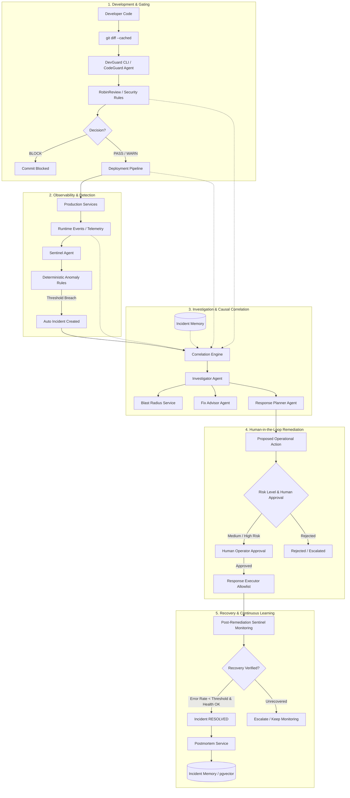

# AI SOFTWARE INCIDENT RESPONSE AGENT

[](https://www.python.org/downloads/)
[](https://fastapi.tiangolo.com)
[](https://docs.pydantic.dev/)
[](https://www.sqlalchemy.org/)
[](LICENSE)

An end-to-end, autonomous yet human-in-the-loop incident response platform backend. It connects developer commits, pre-commit code reviews, deployments, runtime observability, automated anomaly detection, evidence-backed Root Cause Analysis (RCA), blast radius calculation, Fix Advisor developer guidance, operational remediation, recovery monitoring, postmortems, and historical incident memory.

---

## 🏗️ System Architecture



---

## 🤖 Agent Roles & Responsibilities

| Agent | Core Responsibility | Key Invariant |
| :--- | :--- | :--- |
| **Sentinel Agent** | Deterministic error spike and threshold detection across runtime events. | Never relies on an LLM for threshold detection; deterministic rule-based triggers only. |
| **CodeGuard Agent** | Pre-commit staged diff analyzer (`devguard review-staged`). | Blocks commit on `BLOCK` findings; permits on `WARN` / `PASS`. |
| **Investigator Agent** | Correlates changes chronologically, gathers evidence, and synthesizes structured RCA. | Explicitly distinguishes **Observed Evidence** from **AI Inference**. |
| **Fix Advisor Agent** | Formulates precise developer code recommendations, affected files/lines, and validation steps. | **CRITICAL:** NEVER modifies, patches, commits, or pushes source code directly. |
| **Response Planner Agent** | Formulates operational remediation proposals (rollback, restart, feature disable) with risk classification. | Medium/High risk actions strictly require human authorization. |

---

## 🛠️ Technology Stack

* **Core Framework:** Python 3.12+, FastAPI, Pydantic v2
* **Persistence:** SQLAlchemy 2.0, PostgreSQL with `pgvector` (production) & SQLite (zero-config local dev & tests)
* **Migrations:** Alembic
* **Caching & Queues:** Redis (with local in-memory fallback)
* **HTTP Client:** HTTPX
* **Testing:** Pytest (18/18 Unit, API, Safety, and E2E lifecycle tests)
* **LLM Integrations:** OpenRouter, Ollama, and deterministic Mock LLM Adapter
* **Containerization:** Docker, Docker Compose

---

## 🔒 12 Critical Business Rules Enforced

1. **RULE 1:** AI may recommend actions but cannot bypass authorization.
2. **RULE 2:** Medium and High risk operational actions strictly require human approval (`status == APPROVED`).
3. **RULE 3:** An action cannot execute unless approved.
4. **RULE 4:** Only allowlisted operational actions (`ALLOWED_OPERATIONAL_ACTIONS`) can execute.
5. **RULE 5:** AI Incident Agent cannot write, patch, commit, or push application source code.
6. **RULE 6:** Developer remains responsible for implementing source code fixes.
7. **RULE 7:** CodeGuard / RobinReview validates developer's new code after the fix.
8. **RULE 8:** Incident resolution requires actual post-remediation recovery verification.
9. **RULE 9:** Observed evidence is strictly distinguished from AI-generated inference.
10. **RULE 10:** Every sensitive AI proposal, human approval, and execution is recorded in an immutable audit log.
11. **RULE 11:** Deterministic security checks and anomaly triggers cannot be replaced by an LLM.
12. **RULE 12:** Secrets and API keys are redacted from logs and payloads.

---

## 🚀 Quickstart & Demo

### 1. Local Setup (Without External Infrastructure)

```bash
# Clone and enter directory
git clone <repo-url>
cd hack

# Create and activate virtual environment
python -m venv .venv
source .venv/bin/activate  # On Windows: .venv\Scripts\activate

# Install dependencies
pip install -r requirements.txt

# Run all automated tests (18 tests)
python -m pytest -v
```

### 2. Run the Interactive End-to-End Incident Demo

Run the complete 10-stage incident lifecycle with one command:

```bash
python scripts/run_incident_demo.py
```

This single command demonstrates:
1. Developer stages code change with DB connection pool reduction.
2. CodeGuard reviews staged diff and issues a warning.
3. Deployment `v1.8.3` is registered.
4. Runtime error spike occurs (HTTP 500 connection timeouts).
5. Sentinel Agent automatically detects the anomaly and triggers Incident `INC-xxx`.
6. Investigator Agent synthesizes evidence-backed RCA and computes Blast Radius.
7. Fix Advisor Agent outputs developer fix guidance (without modifying code).
8. Response Planner proposes operational rollback action.
9. Safety system blocks unauthorized execution attempt.
10. Human operator approves rollback; remediation executor shifts traffic to `v1.8.2`.
11. Sentinel verifies recovery (error rate drops to 0%, health checks pass).
12. Incident status transitions to `RESOLVED`.
13. Structured Postmortem is generated and indexed into semantic Incident Memory.
14. Future investigation semantic retrieval is verified.

---

## 🐳 Docker Deployment

To launch the complete production stack (FastAPI Backend + PostgreSQL with pgvector + Redis):

```bash
docker compose up --build
```

Access:
* **Interactive API Documentation (Swagger UI):** `http://localhost:8000/docs`
* **Alternative API Documentation (ReDoc):** `http://localhost:8000/redoc`
* **Health Probe:** `http://localhost:8000/health`
* **Readiness Probe:** `http://localhost:8000/ready`

---

## 🛡️ DevGuard CLI (`devguard`)

Use DevGuard as a pre-commit hook or CLI safety gate:

```bash
# Review currently staged git changes
python cli/devguard.py review-staged

# Review a specific diff file
python cli/devguard.py review-staged --diff-file /path/to/patch.diff
```

* **Exits 0** on `PASS` or `WARN`
* **Exits 1** on `BLOCK` (preventing git commit)

---

## 📡 REST API Reference Summary

| Method | Endpoint | Description |
| :--- | :--- | :--- |
| `POST` | `/api/events` | Ingest runtime logs/events; triggers Sentinel anomaly rules. |
| `GET` | `/api/events` | Query runtime event log stream. |
| `POST` | `/api/deployments` | Register a new deployment version and commit SHA. |
| `GET` | `/api/deployments` | List deployments. |
| `POST` | `/api/code-reviews/review-staged` | Review staged diff (`devguard` pre-commit endpoint). |
| `POST` | `/api/incidents` | Manually or programmatically create an incident. |
| `GET` | `/api/incidents` | List incidents with status & severity filters. |
| `GET` | `/api/incidents/{id}` | Full incident details with actions and event stream. |
| `POST` | `/api/incidents/{id}/investigate` | Run Investigator agent & generate evidence-backed RCA. |
| `GET` | `/api/incidents/{id}/timeline` | Chronological timeline distinguishing facts vs inferences. |
| `GET` | `/api/incidents/{id}/blast-radius` | Topological blast radius and impacted user journeys. |
| `GET` | `/api/incidents/{id}/similar` | Semantic similarity search across historical incidents. |
| `POST` | `/api/incidents/{id}/actions` | Propose an operational remediation action. |
| `POST` | `/api/actions/{id}/approve` | Human operator approves action. |
| `POST` | `/api/actions/{id}/reject` | Human operator rejects action. |
| `POST` | `/api/actions/{id}/execute` | Execute approved, allowlisted operational action. |
| `POST` | `/api/incidents/{id}/resolve` | Resolve incident after verifying recovery criteria. |
| `GET` | `/api/incidents/{id}/postmortem` | Generate / retrieve structured postmortem. |
| `GET` | `/api/services` | Service catalog and dependency graph topology. |
| `GET` | `/api/audit` | Immutable audit trail of all AI actions, approvals, and executions. |
| `POST` | `/api/webhooks/github` | GitHub webhook handler for push and deployment events. |

---

## 🧪 Automated Test Suite

Run the full pytest test suite:

```bash
python -m pytest -v
```

### Test Coverage Summary:
* `tests/test_unit_rules.py`: Anomaly rules (500 spike, post-deployment, health check, stack trace), severity calculation, allowlist validation.
* `tests/test_safety_and_rules.py`: Unapproved action block, disallowed action rejection, CodeGuard secret blocking, developer responsibility invariant.
* `tests/test_codeguard_cli.py`: CLI testing for `devguard review-staged`.
* `tests/test_api.py`: Complete endpoint test coverage across all routes.
* `tests/test_e2e_incident_lifecycle.py`: 16-step closed-loop end-to-end acceptance test.
